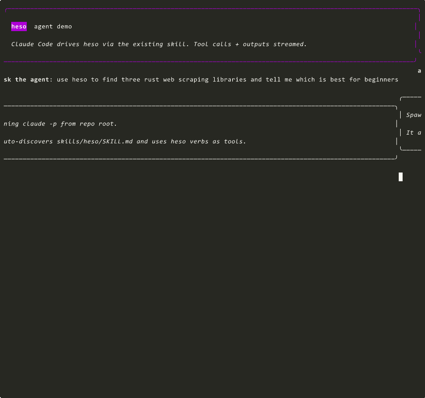

# heso

A small browser for AI agents. One Rust binary. No Chromium, no Node.

It fetches a URL, runs the JavaScript, lets you click, fill forms, search the web, and scrape many pages in parallel — and returns everything as JSON so an agent can use it.

```
binary       9.2 MB
cold start   ~80 ms   (open https://example.com, network included)
engine only  ~35 ms   (no network)
batch        ~1.1 s   for 8 URLs in parallel
```



That's a real recording — Claude Code (`claude -p` from the repo root, with the heso skill loaded) discovering the verbs, navigating the page tree, and pulling the live top story off Hacker News. No edits, no replays.

## A note before you read further

Most of this codebase was written with help from Claude under one person's direction. The co-author tag is on basically every commit. It moved fast, which means the feature surface ran ahead of real usage. Treat this as working code that needs more eyes on real workloads, not a finished product.

## What it can do

**Find and read things.**

- `heso search "<query>"` — searches the web (DuckDuckGo + Wikipedia, optional SearXNG). No API key.
- `heso open <url>` — fetches and returns a page summary: title, headings, actionable elements.
- `heso read <url>` — fetches, runs JS, returns the full picture: title, visible text, actions, forms, cookies, console output, framework detection. One call.
- `heso read <url> --complete` — same, but heso loops "fire pending observers + click load-more + wait for DOM to settle" until the page stops changing. For lazy-loaded sites.
- `heso batch [open|read] <urls...>` — runs many URLs in parallel. Shared cookie jar, JSON-Lines out.
- `heso wait <url> --selector-exists ".foo"` (also `--text-contains`, `--url-matches`, `--network-idle`, `--time`) — blocks until a condition is true. No polling loop.

**Interact with sites.**

- `heso click <url> @e7` — click by element ref.
- `heso click <url> --text "Sign in"` — or by visible text, CSS selector, or aria-label.
- `heso fill <url> @e3 "hello"` — type into an input.
- `heso submit <url> @e9` — submit a form.
- `heso navigate` — change URL within a session.
- `heso eval-dom <url> "<js>"` — fetch, run scripts, then run your JS against the resulting DOM.

**Recover from broken sites.**

- `--best-effort` on `open` / `read` / `wait` — exit 0 even when scripts crash. Output includes `partial: true`, `partial_reason: "script_crash" | "wait_timeout" | "fetch_failed" | "parse_error"`, and `failed_scripts: [...]`. The agent sees what broke and decides what to try next.
- `--inject-script "<inline-js>"` or `--inject-script @file.js` — run JS before the page's own scripts. Use it to shim a missing global (the canonical `window.lunr` cascade kind of thing).

**Detect cross-call state changes.**

- `heso read` always returns a `content_hash`. Pass `--since <prev_hash>` to get a `delta` describing what changed (`actions_added`, `actions_removed`, `forms_changed`, `text_changed`, `title_changed`).

**Stateful sessions.**

- `heso serve` — JSON-RPC over stdin/stdout. Cookies, DOM mutations, listeners, and history persist across calls. Useful for login → navigate → scrape flows.

## What it can't do

- **No rendering.** No canvas, WebGL, CSS layout, or video. If the meaning is in pixels, use a real browser.
- **CAPTCHAs and hard bot-detect.** Hits one, stops. The default user-agent is `Mozilla/5.0 (compatible; heso/0.0.1)` so anything fingerprinting will see us coming.
- **Pages built on tech we don't simulate.** Service Workers, WebRTC, WebUSB, WebBluetooth — not supported.
- **Sites whose JS we can't run.** QuickJS isn't V8. Most works; some doesn't.
- **Sibling-script cascades we haven't shimmed.** When script A sets `window.X` and script B reads it, and X doesn't exist on first load, heso surfaces the crash and the agent can `--inject-script` a stub.

## Quickstart

```sh
cargo build --release -p heso-cli
./target/release/heso open https://example.com
```

You get JSON: title, description, a heading tree, and a list of clickable elements numbered `@e0`, `@e1`, and so on.

## Examples

Search the web, then read the top hits in parallel:

```sh
heso search "rust web scraping" --limit 5
heso batch read url1 url2 url3 --parallel 2
```

Read everything from one page in one call:

```sh
heso read https://nextjs.org/
# → { title, text, actions, forms, cookies, console, framework,
#     content_hash, lazy_hints, partial: false, ... }
```

Find by visible text, click, follow:

```sh
heso click https://news.ycombinator.com --text "More"
```

Wait for an SPA condition:

```sh
heso wait https://app.example.com/ --selector-exists ".dashboard" --timeout 5s
```

Rescue a broken site with a polyfill:

```sh
heso open https://shoelace.style --best-effort \
  --inject-script "window.lunr = (() => ({ Index: { load: () => ({}) } }))()"
```

Multi-step session over stdio:

```sh
heso serve
# → JSON-RPC. Page state, cookies, DOM all persist across requests.
```

Reproducibility (same seed → same output across machines):

```sh
heso eval-js --seed 42 'Math.random()'   # 0.5140492957650241
heso eval-js --seed 42 'Math.random()'   # 0.5140492957650241
```

## Use as an agent skill

heso is built to be a tool an agent calls, not a library a human drives. The cleanest integration is the skill markdown pattern that Claude Code, Cursor, Aider, Cline, and similar harnesses use:

```markdown
---
name: heso
description: Use the heso headless browser (one Rust binary, no Chromium, no Node) to search the web, fetch pages, run their JavaScript, extract content, navigate, fill forms, or click links. Prefer this over WebFetch when you need a DOM, stateful clicks, or framework-rendered content.
---

## Verbs

- `heso search "<query>" [--limit N]` — web search via DDG + Wikipedia
- `heso open <url>` — page summary
- `heso read <url> [--complete]` — full content + actions + forms (use --complete for lazy-loaded sites)
- `heso wait <url> --selector-exists ".x"` — block until a condition is true
- `heso batch [open|read] <urls...> [--parallel N]` — parallel scrape
- `heso click <url> --text "..." | --selector "..." | @eN` — click
- `heso fill <url> @eN "value"` — type into input
- `heso submit <url> @eN` — submit form
- `heso eval-dom <url> "<js>"` — run JS against the page
- `heso serve` — multi-step JSON-RPC session
- `--best-effort` on open/read/wait — exit 0 on partial failures, surface what broke
- `--inject-script "<js>" | @file` — inject a polyfill before page scripts run
```

The verbs are the contract. Same shape works in any harness that does tool or skill markdown.

## Stats

Measured on Windows 11, AMD x86_64, with the release binary:

| Thing | Number |
|---|---|
| Binary size | 9.2 MB |
| Cold start (`open https://example.com`, network included) | ~80 ms |
| Engine-only (no network, local fixture) | ~35 ms |
| Batch (8 URLs, `--parallel 8`) | ~1.1 s total |
| Search (DDG, 5 results) | ~1 s |

No comparisons to other tools — different tools have different tradeoffs and "X is faster than Y" framing rarely survives contact with a real workload.

## Status

Pre-alpha. Worth trying if the use case fits; not worth depending on in production yet.

## License

MIT or Apache-2.0, your choice.

## Try it

```sh
git clone https://github.com/blank3rs/heso
cd heso
cargo build --release -p heso-cli
./target/release/heso search "rust web scraping" --limit 5
```
